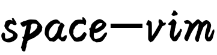
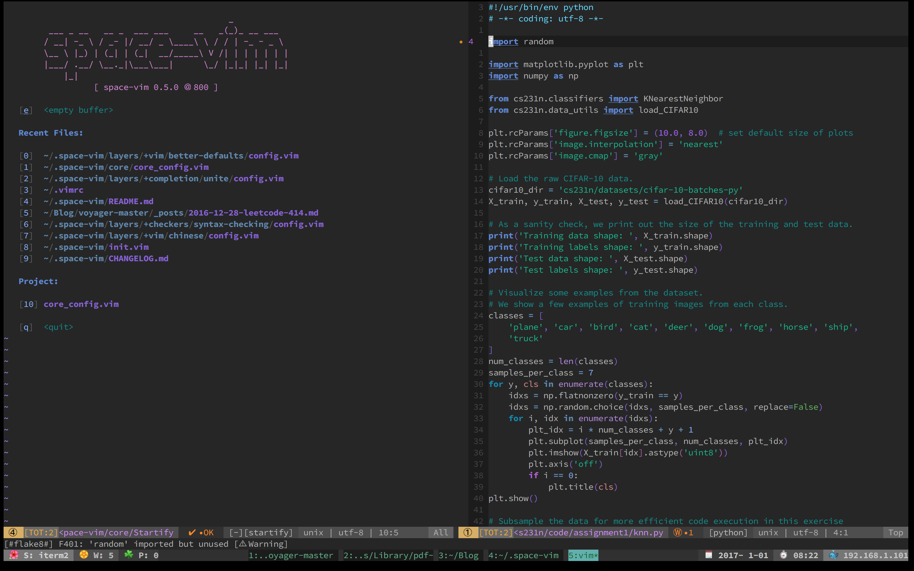
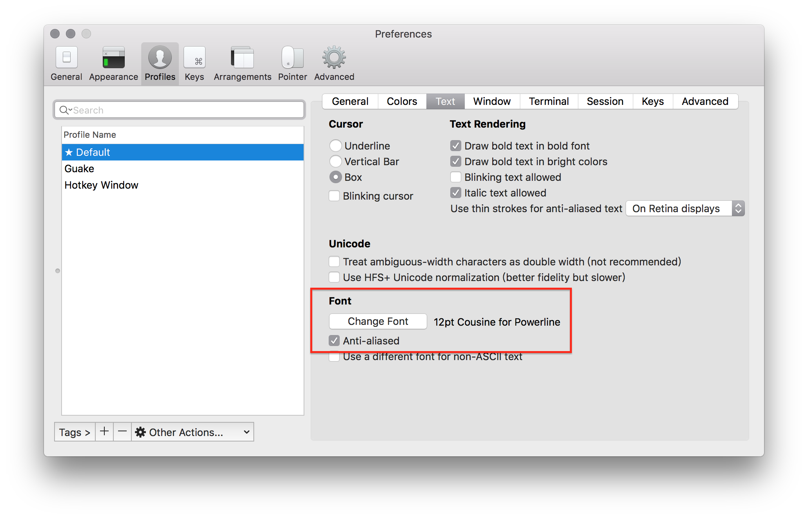
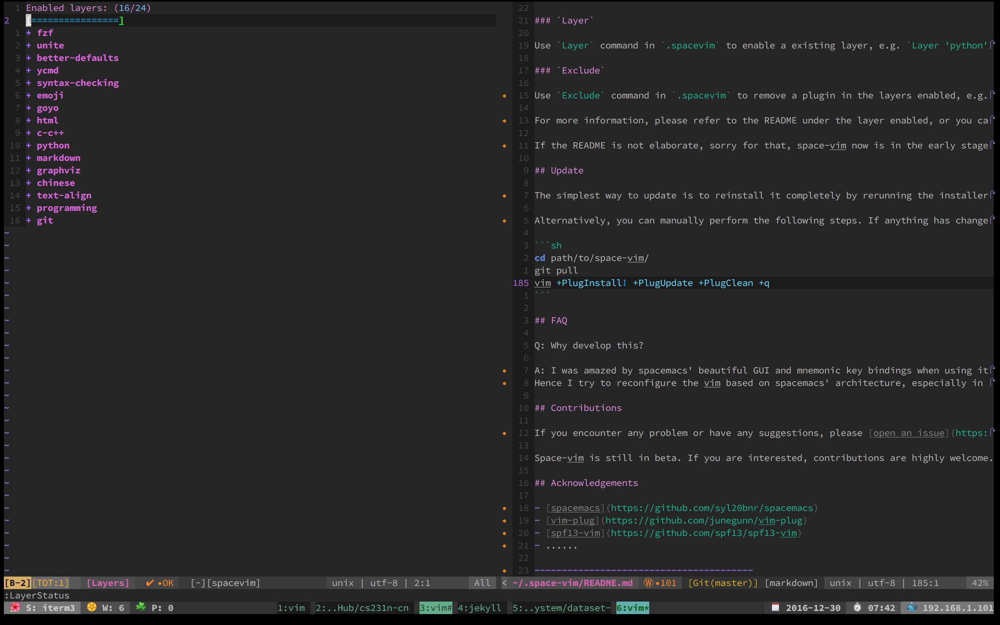

<p align="center"></p>

***

<p align="center">
<b><a href="https://liuchengxu.github.io/space-vim/org/tutorial_cn.html#orgheadline4">前言</a></b> |
<b><a href="https://liuchengxu.github.io/space-vim/org/tutorial_cn.html#orgheadline5">运行截图</a></b> |
<b><a href="https://liuchengxu.github.io/space-vim/org/tutorial_cn.html#orgheadline6">适用人群</a></b> |
<b><a href="https://liuchengxu.github.io/space-vim/org/tutorial_cn.html#orgheadline14">开始使用</a></b> |
<b><a href="https://liuchengxu.github.io/space-vim/org/tutorial_cn.html#orgheadline15">个性化</a></b> |
<b><a href="https://liuchengxu.github.io/space-vim/org/tutorial_cn.html#orgheadline16">更新</a></b> |
<b><a href="https://liuchengxu.github.io/space-vim/org/tutorial_cn.html#orgheadline19">默认安装</a></b> |
<b><a href="https://liuchengxu.github.io/space-vim/org/tutorial_cn.html#orgheadline25">基础键位</a></b> |
<b><a href="https://liuchengxu.github.io/space-vim/org/tutorial_cn.html#orgheadline28">使用建议</a></b>
</p>
***
<p align="center">
<a href="https://github.com/liuchengxu/space-vim"></a>
<a href="https://github.com/liuchengxu/space-vim/blob/master/LICENSE"></a>
<a href="https://travis-ci.org/liuchengxu/space-vim"></a>
</p>
***

### Table of Contents

* [Introduction](#introduction)
* [Features](#features)
* [For whom?](#for-whom)
* [Install](#install)
    * [Linux and macOS](#linux-and-macos)
    * [Windows](#windows)
    * [Manual](#manual)
* [Customize](#customize)
* [How to use](#how-to-use)
* [Update](#update)
* [FAQ](#faq)
* [Contributions](#contributions)
* [Acknowledgements](#acknowledgements)

## Introduction

space-vim is a vim distribution for vim plugins and resources, compatible with Vim and NeoVim.

It is inspired by [spacemacs](https://github.com/syl20bnr/spacemacs) and mimics spacemacs in a high level, especially in the whole architecture, key bindings and GUI. if have ever tried spacemacs, you will find space-vim is very similar to it in user experience.

Elegance here means pleasing, graceful as well as simple. If you are unfamiliar with spacemacs, you can visit [spacemacs.org](http://spacemacs.org/doc/DOCUMENTATION.html) for more about the priciple behind that, which is also what space-vim seeks.

The distribution is completely customizable using `.spacevim`, which is equivalent to `.spacemacs` in spacemacs.


(Terminal vim with space-vim-dark theme)

## Features

- **Beautiful interface:** I have also written a vim colorscheme [space-vim-dark](https://github.com/liuchengxu/space-vim-dark) based on spacemacs-dark theme. You could also try [spacemacs-theme.vim](https://github.com/colepeters/spacemacs-theme.vim), which looks nice in GUI vim.

    
    (Terminal vim with `set termguicolors`)

- **Mnemonic key bindings:** commands have mnemonic prefixes like <kbd>SPC b</kbd> for all the buffer commands.

    Meanwhile, the whole key bindings have been well adapted for vim for the lack of great plugins similar to which-key in emacs. Most key bindings are limited to no more than two keystrokes without counting `<Leader>` or `<LocalLeader>` in, e.g. <kbd>SPC x d</kbd> to delete trailing whitespaces.

    For different language layers, `<LocalLeader>`, <kbd>,</kbd> as default in space-vim, can be seen as the major-mode prefix in spacemacs.

## For whom?

- the novice vim users
- the vimmers who pursuit a beautiful appearance
- the users using both vim and spacemacs

If you have been a vimmer for quite a while, just pick out the part you are interested in. space-vim is well-organized due to the layers concept, you can easily find what you want.

## Install

You have to satisfy some prerequisites at first:

- vim with `+python` or `+python3` feature.

    If `:echo has('python')` or `:echo has('python3')` returns `1`, then you are done. What's more, the most recent vim version is recommended.

- git.

:exclamation: ~~When layers enabled at the first time, you need to run `:PlugInstall` to install relevant plugins~~.

### Linux and macOS

- curl

    ```sh
    sh -c "$(curl -fsSL https://raw.githubusercontent.com/liuchengxu/space-vim/master/install.sh)"
    ```

- wget

    ```sh
    sh -c "$(wget -qO- https://raw.githubusercontent.com/liuchengxu/space-vim/master/install.sh)"
    ```

    :warning: For neovim, after the quick installer is done, you still need to create a symlink:

    ```sh
    ln -s ~/.space-vim/init.vim ~/.config/nvim/init.vim
    ```

### Windows

Not tested now.

### Manual

1. clone [space-vim](https://github.com/liuchengxu/space-vim)

    ```sh
    git clone https://github.com/liuchengxu/space-vim.git ~/.space-vim
    ```

2. install [vim-plug](https://github.com/junegunn/vim-plug#installation), refer to vim-plug installation section for more information.

3. create a symlink

    ```sh
    # for vim
    ln -s ~/.space-vim/init.vim ~/.vimrc

    # for neovim
    ln -s ~/.space-vim/init.vim ~/.config/nvim/init.vim
    ```
4. (Optional) Install the [Source Code Pro](https://github.com/adobe-fonts/source-code-pro) or [Powerline](https://github.com/powerline/fonts) font.

    If you are running in terminal you'll need to change font settings of your terminal as well.

    

5. Open vim, then space-vim will automatically install the missing plugins in enabled layers. If auto-installation fails unexpectly, please try running `:PlugInstall` manually.

## Customize

You can use `.spacevim` in your home directory to customize space-vim, where you can enable the existing layers, add your extra plugins and private configurations.

If `.spacevim` does not exist, none of the vim configurations will be loaded!

```vim
" You can enable the existing layers in space-vim and
" exclude the partial plugins in a certain layer.
" The command Layer and Exlcude are vaild in the function Layers().
function! Layers()

    " Default layers, recommended!
    Layer 'fzf'
    Layer 'unite'
    Layer 'better-defaults'

endfunction

" Put your private plugins here, e.g., change the colorscheme.
function! UserInit()

    " Space has been set as the default leader key,
    " Comma has been set at the default localleader key.
    " If you want to change it, uncomment and set it here.
    " let g:spacevim_leader = "your leader key"
    " let g:spacevim_localleader = 'your localleader key'

    " Install private plugins
    Plug 'morhetz/gruvbox'

endfunction

" Override the existing configurations and add extras here.
function! UserConfig()

    " color gruvbox

endfunction
```

If you want to use GUI color in terminal vim, add this to `UserConfig()`:

```vim
set termguicolors
" If you use vim inside tmux, see https://github.com/vim/vim/issues/993
" set Vim-specific sequences for RGB colors
let &t_8f = "\<Esc>[38;2;%lu;%lu;%lum"
let &t_8b = "\<Esc>[48;2;%lu;%lu;%lum"
```

For more details about true colour, please see the gist [TrueColour.md](https://gist.github.com/XVilka/8346728).

If have a heavy customized configuration, you can organize them in **private** directory with `packages.vim` and `config.vim` too, which will be loaded on startup. The **private** directory can be considered as either a single layer, i.e., in which you can put packages.vim and config.vim, or a set of multiple layers.

## How to use

I recommend you to look through the existing key bindings via <kbd>SPC ?</kbd>. What's more, you definitely can not miss reading the README of [better-defaults layer](https://github.com/liuchengxu/space-vim/blob/master/layers/%2Bvim/better-defaults/README.md), which is of great importance for you to get started quickly.

For more information, please refer to the README under the certain layer enabled, or you can see config.vim and packages.vim directly.

If the README is not elaborate, sorry for that, space-vim now is in the early stages and a ton of stuff are waiting to be done.

## Update

The simplest way to update is to reinstall it completely by rerunning the installer above. It will non-destructively upgrade to the latest version.

Alternatively, you can manually perform the following steps. If anything has changed with the structure of the configuration, you will have to create the appropriate symlinks.

```sh
cd path/to/space-vim/
git pull origin master
```

## FAQ

>Q: Why develop this?

A: I was amazed by spacemacs' beautiful GUI and mnemonic key bindings when using it at the first time. Now I often use spacemacs when in GUI environment. But in the terminal, vim is definitely my first choice. Then I hope to maintain consistency in operation as much as possible in either scenario.
Hence I try to reconfigure the vim based on spacemacs' architecture, especially in key bindings and GUI. This is space-vim at present.

>Q: How do you think of spacemacs, space-vim as well as some other vim configurations/distributions derived from spacemacs?

A: Spacemacs' popularity indeed benefits a great number of people, making remarkable contributions to the community. I truly appreciate @syl20bnr and the whole contributors' outstanding works and have learnt many lessons from spacemacs.

For space-vim, it was merely a personal vim configuration for the purpose of convenience of users using vim and spacemacs at the same time. I am glad that some people like it and give many suggestions to improve it.

If you like space-vim and are willing to polish it, feel free to give any pieces of advice. However, it doesn't mean that I am positive on spending extra time joining some organization focusing on making a spacemacs-like vim distribution. I don't have enough time to maintain or contribute to another similar vim distribution.

It is encouraged to fork space-vim to build up your own personalized vim configuration. It's an open source project, you can turn it into any shape you like.

## Contributions

If you encounter any problem or have any suggestions, please [open an issue](https://github.com/liuchengxu/space-vim/issues/new) or [send a PR](https://github.com/liuchengxu/space-vim/pulls).

Space-vim is still in beta. If you are interested, contributions are highly welcome.

## Acknowledgements

I would like to thank the many people who have helped and contributed to this project.

- [spacemacs](https://github.com/syl20bnr/spacemacs)
- [vim-plug](https://github.com/junegunn/vim-plug)
- [spf13-vim](https://github.com/spf13/spf13-vim)
- ......

----------------------------------------

:warning: 目前支持 Linux and macOS, windows 尚未测试。

如果使用 neovim, 只需要在安装脚本后建立一个软连接:

```sh
ln -s ~/.space-vim/init.vim ~/.config/nvim/init.vim
```

### 快速安装

- curl

    ```sh
    sh -c "$(curl -fsSL https://raw.githubusercontent.com/liuchengxu/space-vim/master/install.sh)"
    ```

- wget

    ```sh
    sh -c "$(wget -qO- https://raw.githubusercontent.com/liuchengxu/space-vim/master/install.sh)"
    ```

### Table of Contents

* [初衷](#初衷)
* [愿景](#愿景)
* [概览](#概览)
    * [名词解释](#名词解释)
        * [Layer](#layer)
        * [Exclude](#exclude)
        * [`.spacevim`](#spacevim)
    * [如何使用](#如何使用)
        * [键位设定](#键位设定)
        * [`.spacevim`](#spacevim-1)
        * [`private`](#private)
    * [如何更新](#如何更新)
    * [如何贡献](#如何贡献)
* [致谢](#致谢)

## 初衷

就我自身的使用而言，GUI 环境下我会选择 spacemacs, 但是终端环境下 vim 依然是我的首选, 我希望尽量保持这两个环境下操作的一致性。

所谓优雅 (elegant), 这里的主观成分比较大. 优雅可能包括很多方面, 这里所指的优雅首先必然不是简陋，抑或简单，而是指简约而美观。

space-vim 得益于 layer 的概念，非常易于扩展，也为下面的愿景提供了土壤。


(Terminal vim, space-vim-dark theme)


(Terminal vim 使用 24 bit true color, `set termguicolors`)

终端环境我基本都会使用 tmux, [这里](https://github.com/liuchengxu/dotfiles/blob/master/tmux.conf) 是我的 tmux 配置.

## 愿景

集百家之长，惠千家万家。

## 概览

### 名词解释

space-vim 既然是从 spacemacs 启发而来，自然借鉴了非常多的东西，其中最重要的一个概念便是 “Layer”.

#### Layer

[space-vim](https://github.com/liuchengxu/space-vim) 目前实现了 Layer 的概念, 就像这样：

```vim
call LayersBegin()

    Layer 'emoji'
    Layer 'colors'
    Layer 'python'
    Layer 'markdown'
    Layer 'syntax-checking'

call LayersEnd()
```

在 space-vim 中，所谓的一个 Layer ，其实很简单，就是集成了一些相关的 vim 插件及其配置，涉及到两个文件: config.vim 与 packages.vim. 不难理解，config.vim 为该 Layer 的相关配置信息，packages.vim 则为该 Layer 所需的一些 vim 插件。

比如 Layer better-defaults, packages.vim 中的插件有(以当前实际配置为准)：

```vim
Plug 'liuchengxu/vim-better-default'
Plug 'SirVer/ultisnips'
Plug 'honza/vim-snippets'
Plug 'Raimondi/delimitMate'
Plug 'tpope/vim-surround'
Plug 'easymotion/vim-easymotion'
Plug 'mhinz/vim-startify'
Plug 'scrooloose/nerdtree',                     { 'on': 'NERDTreeToggle' }
Plug 'Xuyuanp/nerdtree-git-plugin',             { 'on': 'NERDTreeToggle' }
Plug 'tiagofumo/vim-nerdtree-syntax-highlight', { 'on': 'NERDTreeToggle' }
Plug 'bronson/vim-trailing-whitespace',         { 'on': 'FixWhitespace'  }
```

调整，增加 Layer 都非常方便, 这也为 “集百家之长” 提供了土壤。

#### Exclude

如果想要删除 layer 中的某个插件，可执行 `Exclude` 命令，比如:

```vim
Exclude `Shougo/denite.vim`
```

:warning: 不过需要注意，执行 `Exclude` 虽然可以禁用插件，但是 space-vim 默认对于该插件的一些配置信息仍然会被加载，也许会出现异常，需要留心。

#### `.spacevim`

这个对应的是 `.spacemacs`, 用户可以自己决定启用哪些 Layer, 可以加载 space-vim 中没有的插件. 首次一键安装 space-vim 时，.spacevim 会在当前用户目录默认生成，其中主要有两个函数:

```vim
" Put layers you want to enable as well as extra private plugins
function! UserInit()

    " Space has been set as the default leader key,
    " if you want to change it, uncomment and set it here.
    " let g:spacevim_leader = "<\Space>"
    " let g:spacevim_localleader = ','

    " Put the layers you want to enable
    Layer 'python'

    " Put private plugins
    Plug 'extr0py/oni'

endfunction

" Customize configuration
function! UserConfig()

    color space-vim-dark

endfunction

```

`LayerStatus` 可以查看启用了哪些 Layer.



### 如何使用

对于老司机而言，可以选择参考感兴趣的 Layer 下的一些配置，也非常欢迎分享老司机的开车经验。

如果是新手上路，更多使用信息请点击 [这里](liuchengxu.github.io/space-vim/org/tutorial_cn.html#orgheadline4), 也可查看 [wiki](https://github.com/liuchengxu/space-vim/wiki) 也许会有收获。

[better-defaults](https://github.com/liuchengxu/space-vim/blob/master/layers/%2Bvim/better-defaults/README.md) Layer 为必看内容，这里包含了所有包括 buffer, window, motion等等的基本操作。了解它们是能够愉快使用 space-vim 的前提。

下面为简短介绍。

#### 键位设定

space-vim 虽然启发自 spacemacs, 但 emacs 与 vim 始终有所区别。比如 vim  目前似乎还没有对应 which-key 的完美插件, 无法给出实时的快捷键提示。因此 space-vim 的快捷键设定在模仿 spacemacs 的基础上，尽量将其调整控制在两个及以内，再多恐怕就不太能够接受了。

#### `.spacevim`

个性化配置文件为 `.spacevim`, 位于当前用户目录. 如果没有 `.spacevim`, space-vim 将不会加载 **任何配置**。

```vim
" Layers() 可以启用 space-vim 已有的 layer, 并可使用 Exclude 禁用 layer 中的部分插件。
function! Layers()

    " Default layers, recommended!
    Layer 'fzf'
    Layer 'unite'
    Layer 'better-defaults'

endfunction

" UserInit() 可以放置私人个性化的一些插件, 也可更改 Leader 与 LocalLeader key (不推荐)。
function! UserInit()

    " Space has been set as the default leader key,
    " Comma has been set at the default localleader key.
    " If you want to change it, uncomment and set it here.
    " let g:spacevim_leader = "your leader key"
    " let g:spacevim_localleader = 'your localleader key'

    " Install private plugins
    Plug 'morhetz/gruvbox'

endfunction

" 在这里放置配置信息进行覆盖已有设置, 比如，改变主题。
function! UserConfig()

    " color gruvbox

endfunction
```

更多使用信息可以查看 Layer 目录下对应的 README, 当然了目前还比较粗糙，如果 README 不够详尽，还是得要查看 config.vim 和 packages.vim.

#### `private`

private 可以看做是一个 Layer ，如果个人配置比较多，可以放在这里, private 目录可以有 Layer 的两个 "标准" 文件, space-vim 在启动时也会进行加载：

- packages.vim
- config.vim

private 也可看做是多个 Layer 的集合。

### 如何更新

进入 `~/.space-vim`, 执行 `git pull origin master` 即可.

### 如何贡献

如有任何的建议或意见，欢迎 [open an issue](https://github.com/liuchengxu/space-vim/issues/new) 与[send a PR](https://github.com/liuchengxu/space-vim/pulls).

## 致谢

- [spacemacs](https://github.com/syl20bnr/spacemacs)
- [vim-plug](https://github.com/junegunn/vim-plug)
- [spf13-vim](https://github.com/spf13/spf13-vim)
- ......
