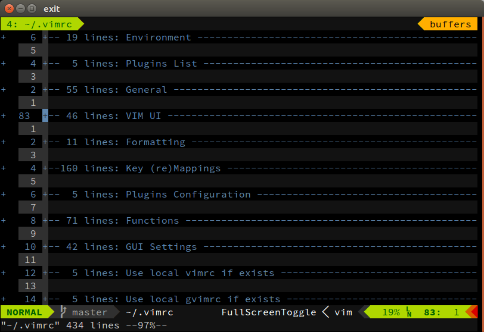

# space-vim

[space-vim](https://github.com/liuchengxu/space-vim) is a vim distribution inspired by [spacemacs](https://github.com/syl20bnr/spacemacs), especially in key bindings.
Hence it is friendly to those who use spacemacs and vim at the same time.

And it also learns much from other first-class vim configurations, such as [spf13-vim](https://github.com/spf13/spf13-vim).
Thanks for their outstanding works.

Screenshots:

- ubuntu



- macOS


## [中文指南](doc/tutorial_cn.md)

## Installation

You need to statisfy some prerequisites to make all the plugins work, especially vim complied with certain features, such as python, and some other tools used by related plugins. [Here is a recommended list](doc/tutorial_cn.md#prerequisites).

It is easy to install space-vim with curl or wget.

- curl

  ```
  sh -c "$(curl -fsSL https://raw.githubusercontent.com/liuchengxu/space-vim/master/install.sh)"
  ```

- wget

  ```
  sh -c "$(wget -qO- https://raw.githubusercontent.com/liuchengxu/space-vim/master/install.sh)"
  ```

## How to use

If you are just starting to use vim, refer to [中文指南](doc/tutorial_cn.md) for some tips.

If you have been a vimer for a while, refer to the `vimrc` related files directly.

## Updating to the latest version

You can manually perform the following steps, or completely reinstall space-vim, which is more easier and safer.

```
cd ~/.space-vim
git pull
vim +PluginInstall! +PluginClean +q
```

## Todo

[space-vim](https://github.com/liuchengxu/space-vim) is a work in progress, so any ideas and patches are appreciated.

- Windows compatibility.
