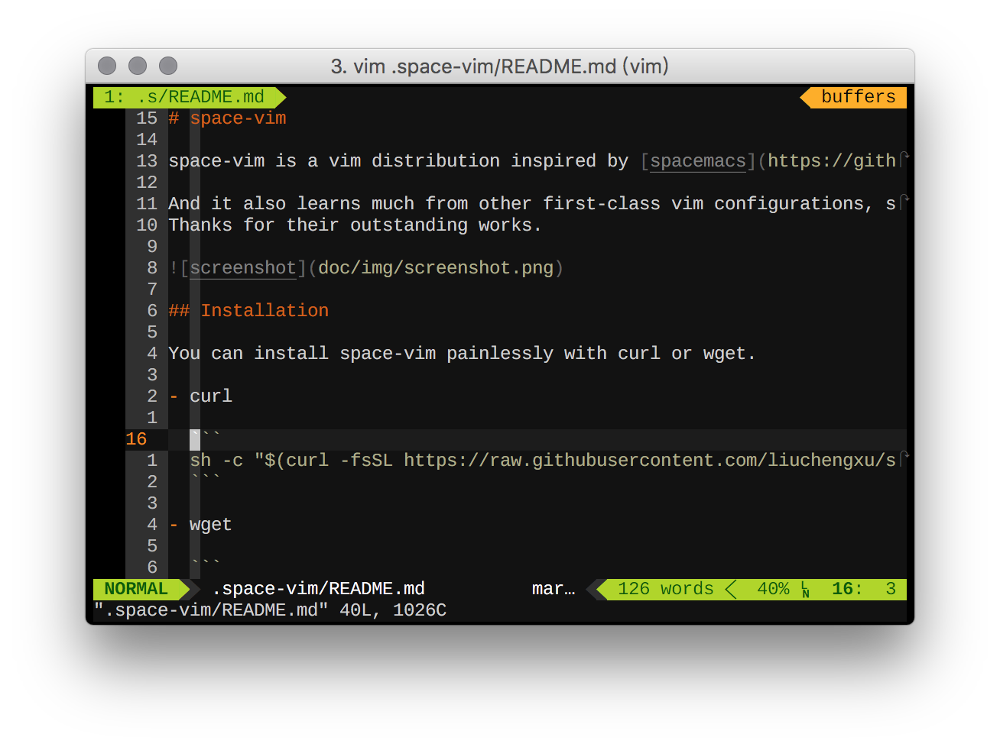
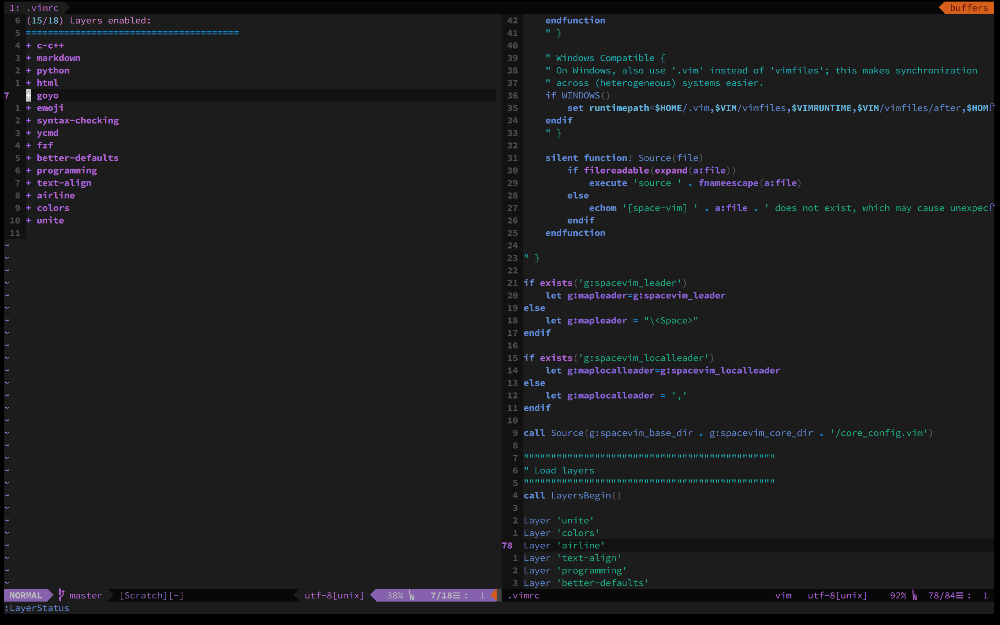

<p align="center"></p>

***
<p align="center">
<a href="https://github.com/liuchengxu/space-vim"></a>
<a href="https://github.com/liuchengxu/space-vim/blob/master/LICENSE"></a>
</p>
***

:warning: 目前支持 Linux and macOS, windows 尚未测试。

如果使用 neovim, 只需要在安装脚本后建立一个软连接:

```sh
ln -s ~/.space-vim/init.vim ~/.config/nvim/init.vim
```

### 快速安装

- curl

    ```sh
    sh -c "$(curl -fsSL https://raw.githubusercontent.com/liuchengxu/space-vim/master/install.sh)"
    ```

- wget

    ```sh
    sh -c "$(wget -qO- https://raw.githubusercontent.com/liuchengxu/space-vim/master/install.sh)"
    ```

### Table of Contents

<!-- vim-markdown-toc GFM -->
* [初衷](#初衷)
* [愿景](#愿景)
* [概览](#概览)
    * [名词解释](#名词解释)
        * [Layer](#layer)
        * [Exclude](#exclude)
        * [.spacevim](#spacevim)
    * [如何使用](#如何使用)
        * [键位设定](#键位设定)
        * [`.spacevim`](#spacevim-1)
        * [`private`](#private)
    * [如何更新](#如何更新)
    * [如何贡献](#如何贡献)
* [展望](#展望)
* [致谢](#致谢)

<!-- vim-markdown-toc -->

## 初衷

[spacemacs](https://github.com/syl20bnr/spacemacs) 可能已经成为 emacs 社区中 “唯我独尊”的配置，在 github 上有近万的 star， contributor 众多。它的 “社区驱动” (community-driven) 真的是很 “耐力持久”，贡献的人很多，UI 很漂亮，功能也很强大。作为 emacs 长久以来的对家 vim, 如果也能有一个这样一个社区驱动的配置，相信也会给大家带来很多便利。

正如 spacemacs 所称，“The best editor is neither Emacs nor Vim, it's Emacs **and** Vim!”, 最好的编辑器既不是 Emacs 也不是 Vim, 而是 Emacs 和 Vim! 所以不管是从实用角度，还是从设计概念，操作哲学的角度，这两个都是非常值得学习的。此外，“编辑器”始终是编辑器，取代不了 IDE，因为吸引我们的更多是深入其中的过程。

就我自身的使用而言，GUI 环境下我会选择 spacemacs, 但是终端环境下 vim 依然是我的首选。我希望尽量保持这两个环境下操作的一致性。此外，vim 社区中，虽有 [spf13-vim](https://github.com/spf13/spf13-vim), [k-vim](https://github.com/wklken/k-vim) 等一些比较有名的 vim 配置，但始终整合的不够，散落着很多适用特定环境的很好的配置，比如针对 c-c++, python, ruby 等等不同语言环境。还有大多也不够漂亮（当然了，这个有点主观，但不管怎么说，年轻人就是要挑“好看”的-_-）。

随着 vim8 的升级，会有很多新的更好的插件诞生，比如我用来替代 [syntastic](https://github.com/vim-syntastic/syntastic) 的 [ale](https://github.com/w0rp/ale), ale 使用了异步特性，再也不用因为语法检查而拖慢速度了。还有[asyncrun.vim](https://github.com/skywind3000/asyncrun.vim) 等等，都会成为我们新的选择。 spf13-vim 等的更新似乎不太跟得上步伐，希望集体智慧能够给我们带来一个更好用的 vim 配置。



终端环境我基本都会使用 tmux, [这里](https://github.com/liuchengxu/dotfiles/blob/master/tmux.conf)是我的 tmux 配置.

## 愿景

集百家之长，惠千家万家。

## 概览

### 名词解释

space-vim 既然是从 spacemacs 启发而来，自然借鉴了非常多的东西，其中最重要的一个概念便是 “Layer”.

#### Layer

[space-vim](https://github.com/liuchengxu/space-vim) 目前实现了 Layer 的概念, 就像这样：

```vim
call LayersBegin()

Layer 'fzf'
Layer 'emoji'
Layer 'colors'
Layer 'python'
Layer 'markdown'
Layer 'syntax-checking'

call LayersEnd()
```

在 space-vim 中，所谓的一个 Layer ，其实很简单，就是集成了一些相关的 vim 插件及其配置，涉及到两个文件: config.vim 与 packages.vim. 不难理解，config.vim 为该 Layer 的相关配置信息，packages.vim 则为该 Layer 所需的一些 vim 插件。

比如 Layer better-defaults, packages.vim 中的插件有：

```vim
Plug 'liuchengxu/vim-better-default'
Plug 'SirVer/ultisnips'
Plug 'honza/vim-snippets'
Plug 'Raimondi/delimitMate'
Plug 'tpope/vim-surround'
Plug 'easymotion/vim-easymotion'
Plug 'mhinz/vim-startify'
Plug 'scrooloose/nerdtree', { 'on': 'NERDTreeToggle' }
Plug 'Xuyuanp/nerdtree-git-plugin', { 'on': 'NERDTreeToggle' }
Plug 'tiagofumo/vim-nerdtree-syntax-highlight', { 'on': 'NERDTreeToggle' }
Plug 'bronson/vim-trailing-whitespace', { 'on': 'FixWhitespace' }
```

调整，增加 Layer 都非常方便, 这也为 “集百家之长” 提供了土壤。

#### Exclude

如果想要删除 layer 中的某个插件，可执行 `Exclude` 命令，比如:

```vim
Exclude `Shougo/denite.vim`
```

:warning: 不过需要注意，执行 `Exclude` 需要运行 `PlugClean` 清除本地的插件缓存，这样才能保证清除插件的相关配置不会被加载，否则可能会出现问题。

#### .spacevim

这个对应的是 .spacemacs, 用户可以自己决定启用哪些 Layer, 可以加载 space-vim 中没有的插件. 首次安装 space-vim 时，.spacevim 会在当前用户目录默认生成，其中主要有两个函数:

```vim
" Put layers you want to enable as well as extra private plugins
function! UserInit()

" Space has been set as the default leader key,
" if you want to change it, uncomment and set it here.
" let g:spacevim_leader = "<\Space>"
" let g:spacevim_localleader = ','

" Put the layers you want to enable
Layer 'fzf'

" Put private plugins
Plug 'junegunn/vim-github-dashboard'

endfunction

" Customize configuration
function! UserConfig()

color space-vim-dark

endfunction

```

LayerStatus 可以查看启用了哪些 Layer.



### 如何使用

对于老司机而言，可以选择参考感兴趣的 layer 下的一些配置，也非常欢迎分享老司机的开车经验。

如果是新手上路，更多使用信息请点击 [快速指引](doc/tutorial_cn.md), 也可查看 [wiki](https://github.com/liuchengxu/space-vim/wiki) 也许会有收获。

[better-defaults](https://github.com/liuchengxu/space-vim/blob/master/layers/%2Bvim/better-defaults/README.md) layer 为必看内容，这里包含了所有包括 buffer, window, motion等等的基本操作。了解它们是能够愉快使用 space-vim 的前提。

下面为简短介绍。

#### 键位设定

space-vim 虽然启发自 spacemacs, 但 emacs 与 vim 始终有所区别。比如 vim  没有 helm, 无法给出快速有效的快捷键提示。因此 space-vim 的快捷键设定在模仿 spacemacs 的基础上，尽量将其调整控制在两个及以内，因为再多恐怕就不太能够接受了。

#### `.spacevim`

个性化配置文件为 `.spacevim`, 如果没有 `.spacevim`, 那么 space-vim 仅会加载默认的 Layer. `.space-vim` 中定义了两个函数分别用于加载 Layer 与个人配置信息。

```vim
function! UserInit()

Layer 'fzf'
Layer 'ycmd'
Layer 'syntax-checking'

Layer 'emoji'
Layer 'goyo'

Layer 'html'
Layer 'python'
Layer 'markdown'
Layer 'c-c++'

Exclude 'Shougo/denite.nvim'

" 加载 space-vim Layer中没有的插件
Plug 'tpope/vim-fugitive'
Plug 'junegunn/vim-github-dashboard'

endfunction

function! UserConfig()

color gruvbox

endfunction
```

:warning: 启用 layer 后, 须执行 `:PlugInstall` 来安装相关插件才能真正生效.

更多使用信息可以查看 Layer 目录下对应的 README, 当然了目前还比较粗糙，如果 README 不够详尽，还得要查看 config.vim 和 packages.vim.

#### `private`

private 可以看做是一个 Layer ，如果个人配置比较多，可以放在这里, private 目录可以有 Layer 的两个 "标准" 文件, space-vim 在启动时也会进行加载：

- packages.vim
- config.vim

### 如何更新

进入 `~/.space-vim`, 执行 `git pull` 即可.

### 如何贡献

- 完善，增加 Layer. 遵循已有的 Layer 结构。
- 文档，包括安装细节，使用经验等。

    如有任何的建议或意见，欢迎 [open an issue](https://github.com/liuchengxu/space-vim/issues/new) 与[send a PR](https://github.com/liuchengxu/space-vim/pulls).

## 展望

- 目前还没有在 Windows 下测试，实现了仅 Layer 的按需加载，后续应当还支持一些选项的设置，比如同类插件选择哪一个.
- 很多文档工作。**对于初学者而言，文档可能比什么都重要，装了一些插件不是什么难事，重要的是学会使用这些插件，发挥其功效**。
- ......

    一个人的精力始终是有限的，非常欢迎大家分享自己的使用经验。三个臭皮匠还赛过诸葛亮呢，还不行? 那就四个:p。

    当然啦，可能很多人觉得 vimscript 没有 lisp 那么有表现力，稍显蹩脚。Anyway, 都是工具，乐趣而已。如果能够集思广益，也是利己利人。

    初期阶段，可做的事情还很多，欢迎大家分享与贡献. ：[space-vim](https://github.com/liuchengxu/space-vim)

## 致谢

- [spacemacs](https://github.com/syl20bnr/spacemacs)
- [vim-plug](https://github.com/junegunn/vim-plug)
- [spf13-vim](https://github.com/spf13/spf13-vim)
- ......
