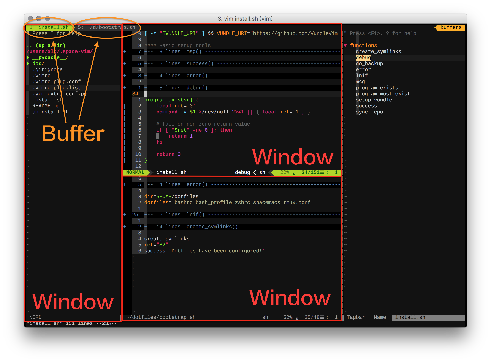

**Table of Contents**

 [Guideline](#guideline)

 [General](#general)

   - [Buffer](#buffer)

   - [File](#file)

   - [Window](#window)

 [Plugins](#plugins)

   - [vim-easymotion](#vim-easymotion)

    
   - [unite.vim](#unitevim)

 [Customization](#customization)

## Guideline

对 vim 稍微有点了解以后，你会发现配置 vim 在思路上其实很简单，无非是一个 `.vimrc` 文件外加安装各种 vim 插件.不过从一个新手开始的话还是挺折腾的.毕竟，默认情况下连 `.vimrc` 这个文件都没有，需要自行创建。

其实现在已经有很多有名气的 vim 配置，但还是自己 “孕育” 而成的才能知根知底，做到 “心中有剑” 而不仅是 “手中有剑”。我建议您在初期的时候可以玩一下那些一流的成品配置， 我也是这么做的，我玩过看过 github 上有名的很多配置。不过在有了一定基础后，还是自己打造一个属于自己的配置更称心如意。希望 space-vim 能对您有所助益。


space-vim 的键位绑定启发自 spacemacs，这也是为什么叫做 space-vim.我同时使用 spacemacs 与 vim, 在桌面环境时倾向于 spacemacs, 终端环境时倾向于 vim.

### 键位绑定

space-vim 的前缀键设置为空格键， 来源于 spacemacs. spacemacs 除了外观漂亮，社区驱动等等优点，使用空格键作为 evil 的前缀键可能也是其中一个成功的卖点，因为可以减轻手指负担，毕竟“触手可及”.

```
let mapleader="\<Space>"
```

从现代键盘设计的角度看，空格键理应受到优待, 毕竟一个人在 “VIP” 区占了好几个位.即使 HHKB 这样的神器，也有空格键的一席之地.


此外，关于 vim 自身的键位设定，开始时能会觉得很奇怪为什么会这样，因为以前的键盘长这样:


看到这个，也就应该能够理解为什么 vim 使用 hjkl 作为方向键，因为物理条件就是这样.

### Prerequisites

在安装 vim  时, 因为不太熟悉可能会走一条捷径， 经常一个安装命令就搞定, 比如 `sudo apt install vim`。不过后期可能会因为缺少某些功能而发生一些问题。 因此， 在前期安装 vim 时最好就将这些问题搞定, 比如编译支持 python 的vim, 因为 后面的插件 YouCompleteMe 需要这一特性. 

mac 下使用 brew 安装的话非常方便， 可以使用 `brew info vim` 看有哪些安装选项，并在安装时指定编译选项：

```
brew install vim --with-lua --with-python3 --with-override-system-vi
```
其他平台下，网络上有很多指引，这里不再赘述。

另外，有些插件用到的一些工具也要安装:

```
# tools used by some plugins
#### syntastic
brew install flake8
npm install jsl jshint
brew install tidy-html5 shellcheck the_silver_searcher
#### tagbar
brew install ctags
#### youcompleteme
brew install cmake
```

### 快捷键

要想使用 vim 提高效率，记住一些快捷键是必然的.而这种事情都是熟能生巧，一些常用操作用多了自然也就记住了.

介绍具体的快捷键之前，先来了解一下一些基本概念，比如 buffer, 比如 window, 否则即使知道快捷键是什么也不知道该怎么用.如下图中的红色边框区域都是 window , `<Leader> w` 都是 window 相关操作的快捷键.

比如我们打开了 NERDTree， 那么如何从 NERDTree 中跳回到 buffer 区进行编辑呢？执行窗口操作 `<Leader> w l` 即可跳到左边的 "窗口".
要知道我第一次进入 NERDTree，不知道怎么回到 buffer 时，没办法只能退出 vim 再重新打开文件.



下面是一些使用频率较高的快捷键， 经常使用熟练以后,很多操作已经成为一种下意识地行为.

## General

这部分大都是一些常用命令的快捷键映射或是默认的一些功能键，下面表格中的快捷键按使用频率排序.

key Binding    | Description
:---:          | :---:
`<Leader> q`   | 退出 (quit)
`<Leader> Q`   | 不保存直接退出
`<Leader> d`   | 向下 (down) 移动半屏
`<Leader> u`   | 向上 (up) 移动半屏
`<Leader> t n` | 显示/隐藏 行号(line number)
`<Leader> t r` | 显示/隐藏 相对(relative)行号
`u`            | 撤消， undo
`U`            | 重做， redo
`H`            | 光标跳转到行首
`L`            | 光标跳转到行尾
`Y`            | 从光标处复制到行尾
`<F5>`         | 编译运行c， cpp, python等文件
`%`            | 光标停留在括号处，%跳转到对应匹配的括号
`Ctrl + c`     | 复制
`Ctrl + v`     | 粘贴

插入模式 (insert mode) 的一些快捷键：

key Binding    | Description
:---:          | :---:
`Ctrl j`   |  向下移动
`Ctrl k`   |  向上移动
`Ctrl h`   |  向左移动
`Ctrl l`   |  向右移动
`jj` | <ESC>
`jk` | <ESC>
`kk` | <ESC>
`;;` | <ESC>

<ESC> 可能是使用非常多的一个键， 如果将 `jj`, `jk` 几个快速退出插入模式的快捷键熟记于心，应当会减轻不少 "切换" 的压力。

### Buffer

缓冲区操作， `<Leader> b`.

我最常用的是 `<Leader> [1-9]`， 直接前缀键加上对应的 buffer 编号即可跳转到该 buffer.
在 `spacemacs` 中， `<Leader> [1-9]` 是跳转到对应的 window. 因为 emacs 中 window 是有编号的,而 vim 中 window 没有编号, buffer 有编号.

key Binding       | Description
:---:             | :---:
`<Leader> [1-9]`  | 切换至对应编号[1-9]对应缓冲区
`<Leader> b b	` | 显示缓冲区 (buffer)
`<Leader> b p	` | 上一个 (previous) 缓冲区
`<Leader> b n	` | 下一个 (next) 缓冲区
`<Leader> b d	` | 删除 (delete) 当前缓冲区
`<Leader> b k`    | 杀掉 (kill) 缓冲区

两个删除缓冲区命令的区别：

- `<Leader> b d` : buffer delete.

- `<Leader> b k` (实际映射的是bw) : like bd， but really delete the buffer. Everything related to the buffer is lost. All marks in this buffer become invalid, option settings are lost, etc. Don’t use this unless you know what you are doing.

### File

文件操作， `<Leader> f`.

打开文件时，可能有些人不太喜欢全部折叠起来，`<Leader> f 9` 即可全部展开.

key Binding        | Description
:---:              | :---:
`<Leader> f s`     | 保存（save）文件
`<Leader> f v	`  | 打开 .vimrc
`<Leader> f l	`  | 打开 .vimrc.plug.list
`<Leader> f c`     | 打开 .vimrc.plug.conf
`<Leader> f R`     | 重新加载vimrc
`<Leader> f [1-9]` | 设置折叠 (fold) 层次，`f 0` 相当于全部折叠, `f 9` 相当于取消折叠全部展开.

### Window

窗口操作, `<Leader> w`.

关于分割窗口的功能，我常常使用 [tmux](https://tmux.github.io) 来实现，因为它也非常值得学习.

key Binding       | Description
:---:             | :---:
`<Leader> w j	` | 移动至下方窗口
`<Leader> w k	` | 移动至上方窗口
`<Leader> w h	` | 移动至左边窗口
`<Leader> w l	` | 移动至右边窗口
`<Leader> w v`    | 竖直分割窗口， 等同于 `<Leader> w |`
`<Leader> w 2`    | 将窗口分割为两列，等同于`<Leader> w v`
`<Leader> w s`    | 水平分割窗口， 等同于 `<Leader> w -`
`<Leader> w d	` | 关闭 (cancel) 当前窗口
`<Leader> w q	` | 退出 (quit) 当前窗口，若是最后一个窗口则退出vim
`<Leader> w w	` | 在所有窗口中循环移动
`<Leader> w r`    | 向右或向下方交换 (replace) 窗口
`<Leader> w m`    | GUI环境下为窗口最大化切换开关.

## Plugins

插件并不是越多越好，每个插件我们常用的大多只是其中一小部分功能而已.插件装多了，vim 一样会慢. vim 也不是配置地功能越强大越好, 选择合适且真正用到的功能，在这些地方用的舒心即可。

有些插件“即装即用”，基本不用配置, 或是"一次配置，终身使用". 有些则稍麻烦一些，不仅是在配置上需要注意，使用上也可能会有一些学习成本，需要有一点耐心才能看到效果.


我不使用 vim 的标签页(tab)功能，所以关于 `<Leader> t` 的快捷键都不涉及 tab 操作.

key Binding    | Description
:---:          | :---:
`<F4>`         | NERDTree (NERD -> 4个字母)
`<F6>`         | Tagbar (Tagbar -> 6个字母)
`<Leader> ?`   | 查看快捷键绑定
`<Leader> ;;`  | 智能注释
`<Leader> b h` | vim起始页（**b**uffer **h**ome）(等同于 `<Leader> f r`)
`<Leader> f r` | 查看最近文件 (**f**ile opened **r**ecently)
`<Leader> x d` | 去除行尾多余空格 (te**x**t **d**elete trailing whitespaces)

### [vim-airline](https://github.com/vim-airline/vim-airline)

vim-airline 最好搭配[powerline fonts](https://github.com/powerline/fonts)字体， space-vim 默认不使用. 不过推荐安装:

```
git clone https://github.com/powerline/fonts.git ~/.fonts
sh ~/.fonts/install.sh
```

powerline font 安装完成后，在 `.vimrc.plug.conf`中的 air-line 中启用字体：

```
let g:airline_powerline_fonts=1
```

设置 terminal 字体：

终端环境下 vim 的字体服从于 terminal 的字体设置，GUI 环境下可直接在配置文件中进行设置. 因此安装完成后需要在 terminal 的字体设置中将原有字体改为带有 for powerline 样式的字体，否则会出现状态栏乱码.

### [vim-colorschemes](https://github.com/flazz/vim-colorschemes)
这个插件集成了很多 vim 的主题，可以自行挑一个在自己机器上显示效果不错的。 比如 atom:

```
echo "color atom" >> ~/.vimrc.local
```


### [vim-easymotion](https://github.com/easymotion/vim-easymotion)

easymotion 默认的前缀键为 `<Leader><Leader>`.

key Binding | 	Description
:---:|:---:
`<Leader><Leader> w`	|单词 (word) 向前快速移动
`<Leader><Leader> b`	|单词向后 (backward) 快速移动
`<Leader><Leader> j`	|行间向下快速移动
`<Leader><Leader> k`	|行间向上快速移动
`<Leader><Leader> s`	|搜索字符 (search) 跳转，双向
`<Leader><Leader> f`	|向前 (forward) 查找字符

为了与spacemacs相一致，我还添加了这几个快捷键:

key Binding | 	Description
:---:|:---:
`<Leader> j w`	| 单词跳转 (jump to word)
`<Leader> j l`	| 行间跳转 (jump to line)

### [unite.vim](https://github.com/Shougo/unite.vim)

unite.vim 可以为 vim 提供一个命令UI，可以将一些不常用或不太好设置的快捷键放到里面.

unite.vim的前缀键为 `localleader`， 这里设置为 `,`.

```
let maplocalleader="，"
```

⌘ 指该操作存在对应的快捷键

[menu] 指 unite.vim 的前缀键，这里也即 `,`.

key Binding | Description
:----:      | :----:
[menu] m    | 查看所有可选菜单（menu）
[menu] x    | 文本 (text)
[menu] f    | 文件 (file) 与 折叠 (fold)
[menu] p    | 插件 (plugin)， 比如syntastic相关功能
[menu] t    | 功能开关(toggle)
[menu] v    | vim相关

unite.vim 这部分配置需要很多心思打磨，有待完善.


### [YouCompleteMe](https://github.com/Valloric/YouCompleteMe)

YouCompleteMe 配置稍显复杂，其实也不复杂，关键在于需要安装一些必要的软件，比如 cmake. 具体可以查阅[其安装介绍](https://github.com/Valloric/YouCompleteMe#mac-os-x).

此外一点注意：必须在 `.vimrc.plug.conf` 中正确设置 Python 路径.如果不设置该选项 YCM 会经常 crashed. python 版本应当与编译 YCM 时的 Python 版本一致， 建议使用 Python3 和绝对路径避免不必要的问题.

```
let g:ycm_path_to_python_interpreter='/absolute/path/to/python'
```

## Customization

vimrc Related      | Description
:---:              | :---:
`.vimrc`           | 也可单独作为无插件vim配置
`.vimrc.plug.list` | 安装的vim插件列表
`.vimrc.plug.conf` | 所安装vim各种插件的相关设置

运行 `sh ~/.space-vim/uninstall.sh` 即可卸载 space-vim.

如果想要修改配置，当然可以选择在我的配置文件上直接修改，但是如果只是些微调，还是建议您采取以下方式:

- 将配置信息写入到 `~/.vimrc.local` ， 比如想要修改主题:

    ```
    echo "color solarized" >> ~/.vimrc.local
    ```

    然后， `<Leader> f R` 使得配置生效.

- 如果想要卸载 space-vim 默认安装的插件， 打开 `~/.vimrc.plug.list` 注释掉对应行即可.

    如果想要安装另外的插件，将插件信息写入到 `~/.vimrc.plug.local` , 比如添加多光标操作[vim-multiple-cursors](https://github.com/terryma/vim-multiple-cursors)这个插件:

    ```
    Plugin 'terryma/vim-multiple-cursors'
    ```

    然后 `<Leader> f R` 使配置生效，并执行 `:PluginInstall` 进行安装.


