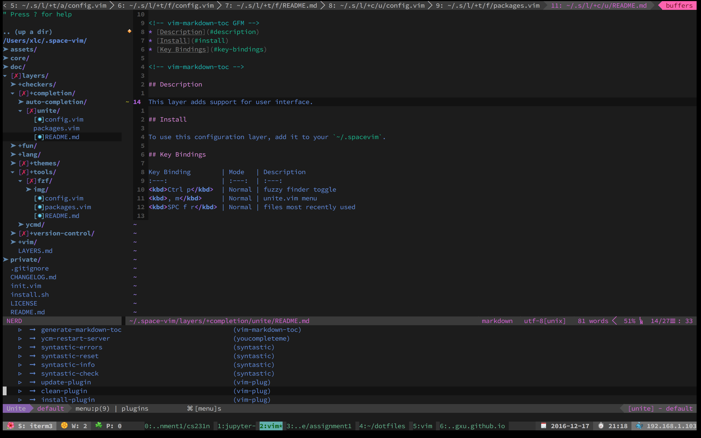

# Unite layer

## Table of Contents

<!-- vim-markdown-toc GFM -->
* [Description](#description)
* [Install](#install)
* [Key Bindings](#key-bindings)

<!-- vim-markdown-toc -->

## Description

This layer adds support for user interface.

## Install

To use this configuration layer, add it to your `~/.spacevim`.

Some commands used in this layer may need some support of other layers.

## Key Bindings

Key Binding        | Mode   | Description
:---:              | :---:  | :---:
<kbd>Ctrl p</kbd>  | Normal | fuzzy finder toggle
<kbd>SPC f r</kbd> | Normal | files most recently used
<kbd>, m</kbd>     | Normal | unite.vim menu

