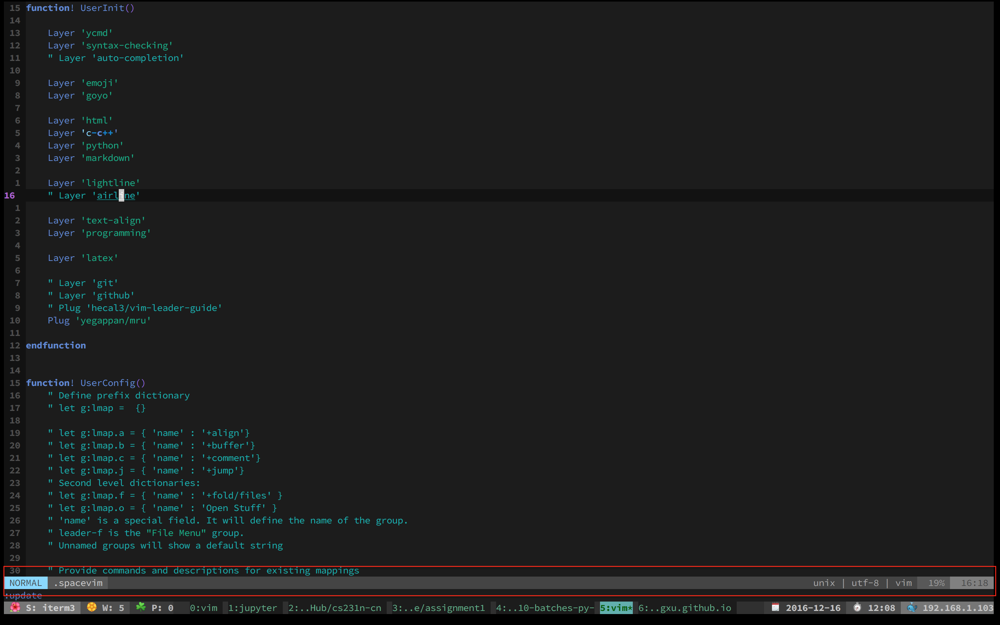

# Lightline layer

## Table of Contents

<!-- vim-markdown-toc GFM -->
* [Description](#description)
* [Install](#install)

<!-- vim-markdown-toc -->

## Description

This layer adds support for a beautiful statusline.

## Install

To use this configuration layer, add it to your `~/.spacevim`.
